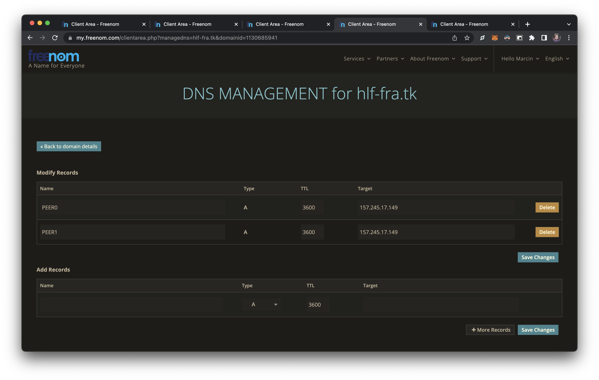

# Getting domains on Freenom

### Main page
Type in domain name that you want to get and press check availability

### Adding domains to the cart
If you find available domains and they're all in the cart, proceed to checkout

### Cart view
In cart view, you can select up to 12 months for free

### Account view
After you "buy" the domains, go to Services -> My Domains

### My domains view
Here open all "Manage Domain" options in new tabs

### Manage domain view
In each tab go to "Manage Freenom DNS"

### Getting public IP
To get public IP addresses of the cluster, type in this command (after Istio is installed on the cluster, it might take a few minutes to assign an EXTERNAL-IP)

`kubectl get svc istio-ingressgateway -n istio-system`

### Organization configs
Create entries on the website according to the screens below

