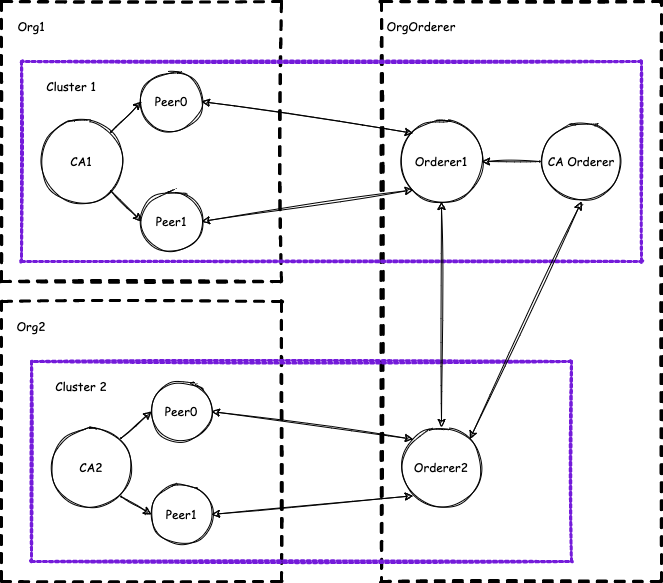

# Multi-cluster deployment of Hyperledger Fabric network 

## What will you find in this repository

* fabcar-js - chaincode written in javascript, borrowed from fabric-samples
* script - automatic script that does everything for you, more information inside the folder
* webinar-notes - notes and presentation shown during the webinar
* freenom.md - guide to get free domains from the website
* readme.md - webinar-notes condensed into a single file

## Using Hyperledger Fabric operator

### What we're going to build


Simple HLF network, consisting of 3 organizations. Orderer organizations has 2 orderers and orderer CA service, while application organizations have 1 CA and 2 peers each.

Note that not all of the connections are visible on the diagram, peers can communicate with any orderer and they also communicate with each other using a gossip protocol.

### Prerequisites

- [helm v3.8.1](https://helm.sh/docs/intro/install/)
- [kubectl v1.23.5](https://kubernetes.io/docs/tasks/tools/)
- [istioctl v1.13.2](https://istio.io/latest/docs/setup/getting-started/#download)
- [kubectl hlf plugin](https://github.com/hyperledger-labs/hlf-operator#installing-the-kubectl-hlf-plugin)
- [yq 4.24.5](https://github.com/mikefarah/yq#install)
- [jq 1.6](https://stedolan.github.io/jq/download/)
- [configtxlator 1.4.3](https://hyperledger-fabric.readthedocs.io/en/release-2.2/install.html)

### Creating a cluster

During the webinar, we will use clusters created on [DigitalOcean](https://www.digitalocean.com/)

Creating a cluster is pretty straightforward - once you log in, press the green button Create -> Kubernetes.

During the demo the default cluster are created
* latest version (1.24.4-do.0)
* 2 basic nodes - 2.5GB RAM usable (4 GB Total) / 2 vCPUs

### Getting the domains

For the PoC purposes we used freenom as a domain provider and DNS management service. To get your own domain go to [freenom website](https://www.freenom.com/), create an account, and get your free domains. For this demo, we need 3 domains, one for each organization:
* ORG1 (hlf-ams.tk)
* ORG2 (hlf-fra.tk)
* ORDERER (hlf-ord.tk)

(for more detailed instructions, open freenom.md file)

### Cluster preparation

#### Config files
Before we jump into the fabric network, we need to prepare the clusters. We need to download cluster configuration files. To do that, go to Manage -> Kubernetes on the left panel, and on both clusters click the three dots -> Download Config.

Put the downloaded files in $HOME/.kube. Now prepare two terminals. To operate on the correct cluster, set environment variable KUBECONFIG to correct path of the file, for example:

`export KUBECONFIG=$HOME/.kube/hlf-ams-kubeconfig.yaml`

#### Installing HLF Operator and Istio

Now we need to install Istio and HLF Operator on a cluster.
Istio provides a load balancer and a public IP for the service.
HLF Operator creates a pod on the cluster where all the logic will be executed.

Installation steps
```bash
helm repo add kfs https://kfsoftware.github.io/hlf-helm-charts --force-update
helm install hlf-operator --version=1.7.0 kfs/hlf-operator

istioctl install -y
```

If everything is correct you should see the pods running
```bash
$ kubectl --namespace=default get pods
NAME                                               READY   STATUS    RESTARTS   AGE
hlf-operator-controller-manager-58cc859489-vzrxq   2/2     Running   0          5m8s

$ kubectl --namespace=istio-system get pods
NAME                                    READY   STATUS    RESTARTS   AGE
istio-ingressgateway-5b8f5c58d8-w9cwf   1/1     Running   0          2m22s
istiod-6599cd4958-5fgsk                 1/1     Running   0          2m38s
```

After istio is deployed, we need to wait a few minutes for it to assign a public IP to the cluster. To check if it is ready, use the following command and look for EXTERNAL-IP

<span style="color:#741BDA"><b>CLUSTER1</b></span>
```bash
$ kubectl get svc istio-ingressgateway -n istio-system
NAME                   TYPE           CLUSTER-IP      EXTERNAL-IP       PORT(S)                                      AGE
istio-ingressgateway   LoadBalancer   10.245.102.77   134.209.132.114   15021:31001/TCP,80:31195/TCP,443:32670/TCP   5m30s
```

<span style="color:#DA741B"><b>CLUSTER2</b></span>
```bash
$ kubectl get svc istio-ingressgateway -n istio-system
NAME                   TYPE           CLUSTER-IP     EXTERNAL-IP      PORT(S)                                      AGE
istio-ingressgateway   LoadBalancer   10.245.5.118   159.89.213.241   15021:31120/TCP,80:31886/TCP,443:30340/TCP   2m54s
```

#### Configuring DNS

To finish the setup, we need to configure DNS, to point the right domains to correct clusters.

To do that, go to freenom.com, login to your account, then go to Services -> My Domains and for each domain open "Manage Domain" in a new tab, and on each new tab open "Manage Freenom DNS".

Now on configure it like this:

On ORG1 Domain:
| Name  | Type | TTL  | Target      |
|-------|------|------|-------------|
| PEER0 | A    | 3600 | CLUSTER1_IP |
| PEER1 | A    | 3600 | CLUSTER1_IP |

On ORG2 Domain:
| Name  | Type | TTL  | Target      |
|-------|------|------|-------------|
| PEER0 | A    | 3600 | CLUSTER2_IP |
| PEER1 | A    | 3600 | CLUSTER2_IP |

On ORDERER Domain:
| Name   | Type | TTL  | Target      |
|--------|------|------|-------------|
| ORD-CA | A    | 3600 | CLUSTER1_IP |
| ORD1   | A    | 3600 | CLUSTER1_IP |
| ORD2   | A    | 3600 | CLUSTER2_IP |

Where CLUSTERX_IP is the EXTERNAL-IP taken from output of the command above from the corresponding cluster.

Changes may take a few minutes. To check if they are in place, the following command can be executed:

```bash
$ dig peer0.hlf-ams.tk +short
134.209.132.114
```

#### Deploying fabric network

Finally we can start working on deploying the network itself.

Let's start creating folders to organize our kubernetes yaml configurations.
```bash
mkdir -p resources/{org1,org2,orderer}
```

##### Deploying CAs

<span style="color:#741BDA"><b>CLUSTER1</b></span>
Creating ORG1 CA
```bash
kubectl hlf ca create \
    --storage-class do-block-storage \
    --capacity 1Gi \
    --name org1-ca \
    --enroll-id enroll \
    --enroll-pw enrollpw \
    --output > resources/org1/ca.yaml
kubectl apply -f resources/org1/ca.yaml
```
<span style="color:#741BDA"><b>CLUSTER1</b></span>
Creating ORDERER CA
```bash
kubectl hlf ca create \
    --storage-class do-block-storage \
    --capacity 1Gi \
    --name ord-ca \
    --enroll-id enroll \
    --enroll-pw enrollpw \
    --hosts ord-ca.hlf-ord.tk \
    --output > resources/orderer/ca.yaml
kubectl apply -f resources/orderer/ca.yaml
```

<span style="color:#DA741B"><b>CLUSTER2</b></span>
Creating ORD2 CA
```bash
kubectl hlf ca create \
    --storage-class do-block-storage \
    --capacity 1Gi \
    --name org2-ca \
    --enroll-id enroll \
    --enroll-pw enrollpw \
    --output > resources/org2/ca.yaml
kubectl apply -f resources/org2/ca.yaml
```

<span style="color:#741BDA"><b>CLUSTER1</b></span>
Wait for CA deployment
```bash
kubectl wait --timeout 180s --for condition=Running fabriccas.hlf.kungfusoftware.es --all
```

<span style="color:#DA741B"><b>CLUSTER2</b></span>
Wait for CA deployment
```bash
kubectl wait --timeout 180s --for condition=Running fabriccas.hlf.kungfusoftware.es --all
```

##### Deploying peers and orderers
<span style="color:#741BDA"><b>CLUSTER1</b></span>
Deploying peer0org1
```bash
kubectl hlf ca register \
    --name org1-ca \
    --user peer0 \
    --secret peer0pw \
    --type peer \
    --enroll-id enroll \
    --enroll-secret enrollpw \
    --mspid Org1MSP
kubectl hlf peer create \
    --storage-class do-block-storage \
    --enroll-id peer0 \
    --enroll-pw peer0pw \
    --mspid Org1MSP \
    --capacity 2Gi \
    --name peer0-ams \
    --ca-name org1-ca.default \
    --hosts peer0.hlf-ams.tk \
    --istio-ingressgateway ingressgateway \
    --istio-port 443 \
    --output > resources/org1/peer0.yaml
kubectl apply -f resources/org1/peer0.yaml
```

<span style="color:#741BDA"><b>CLUSTER1</b></span>
Deploying peer1org1
```bash
kubectl hlf ca register \
    --name org1-ca \
    --user peer1 \
    --secret peer1pw \
    --type peer \
    --enroll-id enroll \
    --enroll-secret enrollpw \
    --mspid Org1MSP
kubectl hlf peer create \
    --storage-class do-block-storage \
    --enroll-id peer1 \
    --enroll-pw peer1pw \
    --mspid Org1MSP \
    --capacity 2Gi \
    --name peer1-ams \
    --ca-name org1-ca.default \
    --hosts peer1.hlf-ams.tk \
    --istio-ingressgateway ingressgateway \
    --istio-port 443 \
    --output > resources/org1/peer1.yaml
kubectl apply -f resources/org1/peer1.yaml
```

<span style="color:#741BDA"><b>CLUSTER1</b></span>
Deploying orderer1
```bash
kubectl hlf ca register \
    --name ord-ca \
    --user orderer1 \
    --secret orderer1pw \
    --type orderer \
    --enroll-id enroll \
    --enroll-secret enrollpw \
    --mspid OrdererMSP
kubectl hlf ordnode create \
    --storage-class do-block-storage \
    --enroll-id orderer1 \
    --mspid OrdererMSP \
    --enroll-pw orderer1pw \
    --capacity 1Gi \
    --name ord1-node \
    --ca-name ord-ca.default \
    --hosts ord1.hlf-ord.tk \
    --istio-ingressgateway ingressgateway \
    --istio-port 443 \
    --output > resources/orderer/orderer1.yaml
kubectl apply -f resources/orderer/orderer1.yaml
```

<span style="color:#DA741B"><b>CLUSTER2</b></span>
Deploying peer0org2
```bash
kubectl hlf ca register \
    --name org2-ca \
    --user peer0 \
    --secret peer0pw \
    --type peer \
    --enroll-id enroll \
    --enroll-secret enrollpw \
    --mspid Org2MSP
kubectl hlf peer create \
    --storage-class do-block-storage \
    --enroll-id peer0 \
    --enroll-pw peer0pw \
    --mspid Org2MSP \
    --capacity 2Gi \
    --name peer0-fra \
    --ca-name org2-ca.default \
    --hosts peer0.hlf-fra.tk \
    --istio-ingressgateway ingressgateway \
    --istio-port 443 \
    --output > resources/org2/peer0.yaml
kubectl apply -f resources/org2/peer0.yaml
```

<span style="color:#DA741B"><b>CLUSTER2</b></span>
Deploying peer1org2
```bash
kubectl hlf ca register \
    --name org2-ca \
    --user peer1 \
    --secret peer1pw \
    --type peer \
    --enroll-id enroll \
    --enroll-secret enrollpw \
    --mspid Org2MSP
kubectl hlf peer create \
    --storage-class do-block-storage \
    --enroll-id peer1 \
    --enroll-pw peer1pw \
    --mspid Org2MSP \
    --capacity 2Gi \
    --name peer1-fra \
    --ca-name org2-ca.default \
    --hosts peer1.hlf-fra.tk  \
    --istio-ingressgateway ingressgateway \
    --istio-port 443 \
    --output > resources/org2/peer1.yaml
kubectl apply -f resources/org2/peer1.yaml
```

<span style="color:#741BDA"><b>CLUSTER1</b></span>
Creating orderer2 user
```bash
kubectl hlf ca register \
    --name ord-ca \
    --user orderer2 \
    --secret orderer2pw \
    --type orderer \
    --enroll-id enroll \
    --enroll-secret enrollpw \
    --mspid OrdererMSP
```

<span style="color:#DA741B"><b>CLUSTER2</b></span>
Creating orderer2 configuration
```bash
kubectl hlf ordnode create \
    --storage-class do-block-storage \
    --enroll-id orderer2 \
    --mspid OrdererMSP \
    --enroll-pw orderer2pw \
    --capacity 1Gi \
    --name ord2-node \
    --ca-name org2-ca.default \
    --hosts ord2.hlf-ord.tk \
    --istio-ingressgateway ingressgateway \
    --istio-port 443 \
    --output > resources/orderer/orderer2.yaml
```

At the current stage of development of HLF Operator the CA needs to be on the same cluster to generate the configuration. To work around that, we will use ORG2 CA server to generate the config, and edit it manually before the deployment. 

The following changes are required to make in file `resources/orderer/orderer2.yaml`:
* set `spec.secret.enrollment.component.cahost` to `"ord-ca.hlf-ord.tk"`
* set `spec.secret.enrollment.component.caport` to `443`
* set `spec.secret.enrollment.tls.cahost` to `ord-ca.hlf-ord.tk`
* set `spec.secret.enrollment.tls.caport` to `443`
* add to `spec.secret.enrollment.tls.csr.hosts` the following entry `"ord-ca.hlf-ord.tk"`
* copy `spec.secret.enrollment.component.catls.cacert` from `resources/orderer/orderer1.yaml` and paste it in 
    * `spec.secret.enrollment.component.catls.cacert` and 
    * `spec.secret.enrollment.tls.catls.cacert` in `resources/orderer/orderer2.yaml`.


<span style="color:#DA741B"><b>CLUSTER2</b></span>
Deploying orderer2
```bash
kubectl apply -f resources/orderer/orderer2.yaml
```

<span style="color:#741BDA"><b>CLUSTER1</b></span>
Wait for peer and orderer deployments
```bash
kubectl wait --timeout 180s --for condition=Running fabricpeers.hlf.kungfusoftware.es --all
kubectl wait --timeout 180s --for condition=Running fabricorderernodes.hlf.kungfusoftware.es --all
```

<span style="color:#DA741B"><b>CLUSTER2</b></span>
Wait for peer and orderer deployments
```bash
kubectl wait --timeout 180s --for condition=Running fabricpeers.hlf.kungfusoftware.es --all
kubectl wait --timeout 180s --for condition=Running fabricorderernodes.hlf.kungfusoftware.es --all
```

##### Creating admin users
<span style="color:#741BDA"><b>CLUSTER1</b></span>
Creating org1 connection configuration files
```bash
kubectl hlf inspect \
    --output org1-config.yaml \
    --organizations Org1MSP
kubectl hlf ca register \
    --name org1-ca \
    --user admin \
    --secret adminpw \
    --type admin \
    --enroll-id enroll \
    --enroll-secret enrollpw \
    --mspid Org1MSP
kubectl hlf ca enroll \
    --name org1-ca \
    --user admin \
    --secret adminpw \
    --mspid Org1MSP \
    --ca-name ca \
    --output org1-admin.yaml
kubectl hlf utils adduser \
    --userPath org1-admin.yaml \
    --config org1-config.yaml \
    --username admin \
    --mspid Org1MSP
```

<span style="color:#741BDA"><b>CLUSTER1</b></span>
Creating orderer1 connection configuration files
```bash
kubectl hlf inspect \
    --output orderer1-config.yaml \
    --organizations OrdererMSP
kubectl hlf ca register \
    --name ord-ca \
    --user admin1 \
    --secret admin1pw \
    --type admin \
    --enroll-id enroll \
    --enroll-secret enrollpw \
    --mspid OrdererMSP
kubectl hlf ca enroll \
    --name ord-ca \
    --user admin1 \
    --secret admin1pw \
    --mspid OrdererMSP \
    --ca-name ca \
    --output orderer1-admin.yaml
kubectl hlf utils adduser \
    --userPath orderer1-admin.yaml \
    --config orderer1-config.yaml \
    --username admin1 \
    --mspid OrdererMSP
```

<span style="color:#DA741B"><b>CLUSTER2</b></span>
Creating org2 connection configuration files
```bash
kubectl hlf ca register \
    --name org2-ca \
    --user admin \
    --secret adminpw \
    --type admin \
    --enroll-id enroll \
    --enroll-secret enrollpw \
    --mspid Org2MSP
kubectl hlf ca enroll \
    --name org2-ca \
    --user admin \
    --secret adminpw \
    --mspid Org2MSP \
    --ca-name ca \
    --output org2-admin.yaml
kubectl hlf inspect \
    --output org2-config.yaml \
    --organizations Org2MSP
kubectl hlf utils adduser \
    --userPath org2-admin.yaml \
    --config org2-config.yaml \
    --username admin \
    --mspid Org2MSP
```

<span style="color:#741BDA"><b>CLUSTER1</b></span>
Creating orderer2 user
```bash
kubectl hlf ca register \
    --name ord-ca \
    --user admin2 \
    --secret admin2pw \
    --type admin \
    --enroll-id enroll \
    --enroll-secret enrollpw \
    --mspid OrdererMSP
kubectl hlf ca enroll \
    --name ord-ca \
    --user admin2 \
    --secret admin2pw \
    --mspid OrdererMSP \
    --ca-name ca \
    --output orderer2-admin.yaml
```

<span style="color:#DA741B"><b>CLUSTER2</b></span>
Creating orderer2 connection configuration files
```bash
kubectl hlf inspect \
    --output orderer2-config.yaml \
    --organizations OrdererMSP
kubectl hlf utils adduser \
    --userPath orderer2-admin.yaml \
    --config orderer2-config.yaml \
    --username admin2 \
    --mspid OrdererMSP
```

##### Creating a channel
<span style="color:#741BDA"><b>CLUSTER1</b></span>
Generating genesis block
```bash
kubectl hlf channel generate \
    --output demo.block \
    --name demo \
    --organizations Org1MSP \
    --ordererOrganizations OrdererMSP
```

<span style="color:#741BDA"><b>CLUSTER1</b></span>
Joining orderer1 to the channel
```bash
kubectl hlf ca enroll \
    --name ord-ca \
    --namespace default \
    --user admin1 \
    --secret admin1pw \
    --mspid OrdererMSP \
    --ca-name tlsca \
    --output orderer1-admin-tls.yaml
kubectl hlf ordnode join \
    --block demo.block \
    --name ord1-node \
    --namespace default \
    --identity orderer1-admin-tls.yaml
```

<span style="color:#741BDA"><b>CLUSTER1</b></span>
Joining org1 peers to the channel to the channel and setting anchor peer
```bash
kubectl hlf channel join \
    --name demo \
    --config org1-config.yaml \
    --user admin \
    --peer peer0-ams.default
kubectl hlf channel join \
    --name demo \
    --config org1-config.yaml \
    --user admin \
    --peer peer1-ams.default
kubectl hlf channel addanchorpeer \
    --channel demo \
    --config org1-config.yaml \
    --user admin \
    --peer peer0-ams.default
```

<span style="color:#DA741B"><b>CLUSTER2</b></span>
Fetch organization config
```bash
kubectl hlf org inspect -o Org2MSP --output-path ./resources/org2
mv ./configtx.yaml ./resources/org2
```

<span style="color:#741BDA"><b>CLUSTER1</b></span>
Adding org2 to the channel configuration
```bash
kubectl hlf channel addorg \
    --peer peer0-ams.default \
    --name demo \
    --config org1-config.yaml \
    --user admin \
    --msp-id Org2MSP \
    --org-config resources/org2/configtx.yaml
kubectl hlf ca enroll \
    --name ord-ca \
    --namespace default \
    --user admin2 \
    --secret admin2pw \
    --mspid OrdererMSP \
    --ca-name tlsca \
    --output orderer2-admin-tls.yaml
```

<span style="color:#DA741B"><b>CLUSTER2</b></span>
Joining orderer2 to the channel
```bash
kubectl hlf ordnode join \
    --block demo.block \
    --name ord2-node \
    --namespace default \
    --identity orderer2-admin-tls.yaml
```

##### Modifying channel config manually
<span style="color:#741BDA"><b>CLUSTER1</b></span>
Fetching channel config
```bash
export PATH=$PATH:$PWD/bin
kubectl hlf channel inspect \
    --channel demo \
    --config org1-config.yaml \
    --user admin \
    --peer peer0-ams.default > demo_original.json
configtxlator proto_encode \
    --input demo_original.json \
    --type common.Config \
    --output config.pb
cp ./demo_original.json ./demo_update.json
```

<span style="color:#DA741B"><b>CLUSTER2</b></span>
Creating orderer2 connection configuration files
```bash
kubectl get pods
# change pod name below to yours
kubectl exec -it ord2-node-7b78df89bc-xpg4s -- cat /var/hyperledger/tls/server/pair/tls.crt | sed -e 's/\r//g' | base64
```

Make the following changes to demo_update.json, where ORD2_CERT is the variable outputted by the command above
```
.channel_group.groups.Orderer.groups.OrdererMSP.values.Endpoints.value.addresses += ord2.hlf-ord.tk:443
.channel_group.groups.Orderer.values.ConsensusType.value.metadata.consenters[1] += {
    "host": "ord2.hlf-ord.tk:443",
    "port": 443,
    "client_tls_cert": "$ORD2_CERT",
    "server_tls_cert": "$ORD2_CERT"
}
```

Run this command to fix orderer1 configuration
```bash
yq -i '.peers = {}' orderer1-config.yaml
```

<span style="color:#741BDA"><b>CLUSTER1</b></span>
Create channel update transaction, sign and submit
```bash
configtxlator proto_encode \
    --input demo_update.json \
    --type common.Config \
    --output modified_config.pb
configtxlator compute_update \
    --channel_id demo \
    --original config.pb \
    --updated modified_config.pb \
    --output config_update.pb
configtxlator proto_decode \
    --input config_update.pb \
    --type common.ConfigUpdate \
    --output config_update.json
echo '{"payload":{"header":{"channel_header":{"channel_id":"'demo'", "type":2}},"data":{"config_update":'$(cat config_update.json)'}}}' | jq . > config_update_in_envelope.json
configtxlator proto_encode \
    --input config_update_in_envelope.json \
    --type common.Envelope \
    --output config_update_in_envelope.pb
kubectl hlf channel signupdate \
    --channel demo \
    -f config_update_in_envelope.pb \
    --user admin1 \
    --config config.yaml \
    --mspid OrdererMSP \
    --output ord-demo-update-sign.pb
hlf channel update \
    --channel demo \
    -f config_update_in_envelope.pb \
    --config org1-config.yaml \
    --user admin \
    --mspid Org1MSP \
    --signatures ord-demo-update-sign.pb
```

##### Joining peers from org2 to the channel
<span style="color:#DA741B"><b>CLUSTER2</b></span>
Joining org2 peers to the channel to the channel and setting anchor peer
```bash
kubectl hlf channel join \
    --name demo \
    --config org2-config.yaml \
    --user admin \
    --peer peer0-fra.default
kubectl hlf channel join \
    --name demo \
    --config org2-config.yaml \
    --user admin \
    --peer peer1-fra.default
kubectl hlf channel addanchorpeer \
    --channel demo \
    --config org2-config.yaml \
    --user admin \
    --peer peer0-fra.default
```

##### Installing the chaincode
<span style="color:#741BDA"><b>CLUSTER1</b></span>
Installing chaincode
```bash
kubectl hlf chaincode install \
    --path ../fabcar-js/ \
    --config org1-config.yaml \
    --language node \
    --label fabcar \
    --user admin \
    --peer peer0-ams.default
kubectl hlf chaincode install \
    --path ../fabcar-js/ \
    --config org1-config.yaml \
    --language node \
    --label fabcar \
    --user admin \
    --peer peer1-ams.default
```

<span style="color:#DA741B"><b>CLUSTER2</b></span>
Installing chaincode
```bash
kubectl hlf chaincode install
    --path ../fabcar-js/ \
    --config org2-config.yaml \
    --language node \
    --label fabcar \
    --user admin \
    --peer peer0-fra.default
kubectl hlf chaincode install \
    --path ../fabcar-js/ \
    --config org2-config.yaml \
    --language node \
    --label fabcar \
    --user admin \
    --peer peer1-fra.default
```

<span style="color:#741BDA"><b>CLUSTER1</b></span>
Installing chaincode (change your CC_PACKAGE_ID!)
```bash
kubectl hlf chaincode queryinstalled \
    --config config.yaml \
    --user admin \
    --peer peer0-ams.default
export CC_PACKAGE_ID=    # fabcar:f0e6793d8f47a00fbbd6cc2cb4fe1a47279c22227790ca3ac6f8a340b1733654
kubectl hlf chaincode approveformyorg \
    --config config.yaml \
    --user admin \
    --peer peer0-ams.default \
    --package-id=${CC_PACKAGE_ID} \
    --version 1.0 \
    --sequence 1 \
    --name fabcar \
    --policy 'OR('\''Org1MSP.member'\'','\''Org2MSP.member'\'')' \
    --channel demo
```

<span style="color:#DA741B"><b>CLUSTER2</b></span>
Installing chaincode (change your CC_PACKAGE_ID!)
```bash
kubectl hlf chaincode queryinstalled \
    --config config.yaml \
    --user admin \
    --peer peer0-fra.default
export CC_PACKAGE_ID=    # fabcar:f0e6793d8f47a00fbbd6cc2cb4fe1a47279c22227790ca3ac6f8a340b1733654
kubectl hlf chaincode approveformyorg \
    --config config.yaml \
    --user admin \
    --peer peer0-fra.default \
    --package-id=${CC_PACKAGE_ID} \
    --version 1.0 \
    --sequence 1 \
    --name fabcar \
    --policy 'OR('\''Org1MSP.member'\'','\''Org2MSP.member'\'')' \
    --channel demo
```

<span style="color:#741BDA"><b>CLUSTER1</b></span>
Committing chaincode and initializing the ledger
```bash
kubectl hlf chaincode commit \
    --config org1-config.yaml \
    --mspid Org1MSP \
    --user admin \
    --version 1.0 \
    --sequence 1 \
    --name fabcar \
    --policy 'OR('\''Org1MSP.member'\'','\''Org2MSP.member'\'')' \
    --channel demo
kubectl hlf chaincode invoke \
    --config org1-config.yaml \
    --user admin \
    --peer peer0-ams.default \
    --chaincode fabcar \
    --channel demo \
    --fcn initLedger -a '[]'
```

<span style="color:#741BDA"><b>CLUSTER1</b></span>
Using chaincode
```bash
kubectl hlf chaincode invoke \
    --config org1-config.yaml \
    --user admin \
    --peer peer0-ams.default \
    --chaincode fabcar \
    --channel demo \
    --fcn createCar \
    --args 'CAR10' \
    --args 'Mazda' \
    --args 'MX5' \
    --args 'black' \
    --args 'Karol'
```

<span style="color:#DA741B"><b>CLUSTER2</b></span>
Using chaincode
```bash
kubectl hlf chaincode invoke \
    --config org2-config.yaml \
    --user admin \
    --peer peer0-fra.default \
    --chaincode fabcar \
    --channel demo \
    --fcn createCar \
    --args 'CAR11' \
    --args 'Seat' \
    --args 'Leon' \
    --args 'black' \
    --args 'Matt'
```

<span style="color:#741BDA"><b>CLUSTER1</b></span>
Using chaincode
```bash
kubectl hlf chaincode query \
    --config org1-config.yaml \
    --user admin \
    --peer peer0-ams.default \
    --chaincode fabcar \
    --channel demo \
    --fcn queryCar \
    --args 'CAR11' | jq
```

<span style="color:#DA741B"><b>CLUSTER2</b></span>
Using chaincode
```bash
kubectl hlf chaincode query \
    --config org2-config.yaml \
    --user admin \
    --peer peer0-fra.default \
    --chaincode fabcar \
    --channel demo \
    --fcn queryCar \
    --args 'CAR10' | jq
```

#### Recommendations

If you want to learn more about HLF Operator, consider checking the following resources:

1. [Introduction to HLF Operator by David Viejo](https://www.youtube.com/watch?v=namKDeJf5QI)
2. [Step by step tutorial by Aditya Joshi](https://www.youtube.com/playlist?list=PLuAZTZDgj0csRQuNMY8wbYqOCpzggAuMo)
